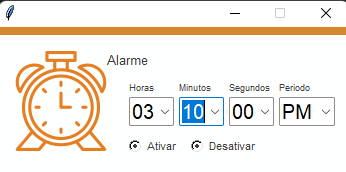
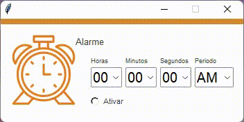

# Despertador
# DESPERTADOR 

Programa desenvolvido em phyton, despertador.

### 📋 Pré-requisitos

De que coisas você precisa para instalar o software e como instalá-lo?

```
1. Python 3.10
2. Tkinter
3. Pillow
4. Matplotlib
6. Pygame
7. Datetime
8. Time
9. Threading

```

### 🔧 Instalação
1. Visual Code Studio
2. Nuitka

## 📦 Imagens do Projeto




## 📌 Animacão




## 📄 SOFTWARE COPYLEFT
O software copyleft é livre e tem o código-fonte aberto, porém, a principal diferença é que os seus produtores querem evitar que tal sistema seja modificado e vendido. Dessa forma, todas as alterações devem ser registradas como copyleft.


## 🎁 Expressões de gratidão

* Conte a outras pessoas sobre este projeto 📢;
* Um agradecimento publicamente 🫂;


---
⌨️ com ❤️ por [Victoria Kelly](https://github.com/xvicxk) 😊
